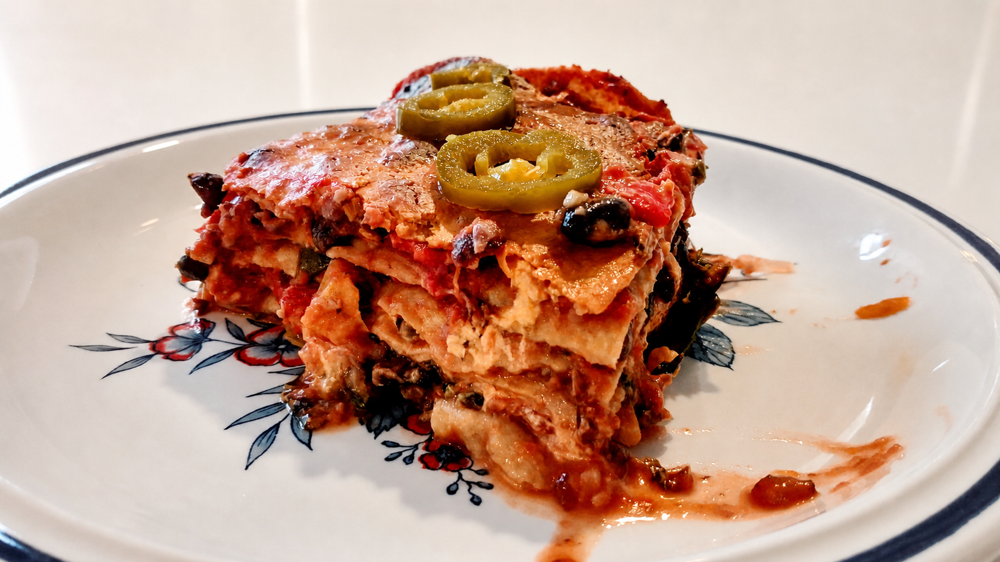

# Eenvoudige enchiladas

_Dit gerecht laat zich perfect op voorhand maken en past ook mooi in de diepvries. Ik maak het meestal in grotere hoeveelheden (drie keer het recept hieronder). Dat is evenveel afwas en niet zo veel meer werk._

_We houden het eenvoudig door laagjes te maken in plaats van rolletjes. Onderaan deze pagina vind je enkele [variaties](#variaties)_

## Bereidingstijd

* Voorbereiding: 30 minuten
* Kooktijd: 30 minuten
* Afwas: kookpot, spatel, snijplank, mesje en ovenschaal

## Ingrediënten (5 personen)

* 1 x [bonenpuree](../bijgerechten/bonenpuree.md)
* 1 x [cashew queso](../bijgerechten/cashew-queso.md)
* 2 paprika's
* 2 stelen bleekselder (of groene selder)
* 1 kg [tomatenstukjes van goede kwaliteit](https://www.collectandgo.be/bioplanet/nl/assortiment/boni-bio-tomaten-stukjes-500g), uit brik of blik
* 4 stelen boerenkool, van de nerf ontdaan en gesneden (of een groente naar keuze)
* 6-8 volkoren wraps (ongeveer 400 g)
* 1 el olie
* ½ tl kaneel
* Een handje pompoenpitten
* Zout en peper
* Garnituur: verse koriander, pijpajuin en/of [jalapeño](https://www.collectandgo.be/colruyt/nl/assortiment/poco-loco-jalape%C3%B1os-groen-220g)

## Bereiding

1. Snijd de selder in kleine stukjes en de paprika iets groter.
2. Bak de gesneden groenten aan in de olie.
3. Voeg de tomatenstukjes toe, samen met een beetje water waarmee je de dozen uitspoelt.
4. Voeg de kaneel toe en laat zachtjes pruttelen onder een deksel.
5. Voeg de boerenkool ergens midden in het kookproces toe.
6. Voeg de bonenpuree toe zodra de groenten gaar zijn en meng alles door elkaar.
7. Breng verder op smaak met peper en zout.
8. Maak in de ovenschaal afwisselend laagjes van het groenten-bonenmengsel en de wraps. Begin met een laag wraps; scheur ze in de vorm van de ovenschaal. Gebruik af en toe een laagje cashew queso boven op de groenten, of apart tussen twee laagjes wraps. Eindig met cashew queso op een laag wraps en garneer met pompoenpitten.
9. Bak ongeveer 20 minuten op 190 &deg;C in de oven.
10. Serveer met verse koriander, gesnipperde pijpajuintjes, jalapeño,...

## Variaties

* **Wraps:** maak een vastere saus door de helft van de tomatenstukjes te vervangen door een blikje tomatenpuree. Iedereen kan aan tafel zelf een wrap maken met het tomaten-bonenmengsel, de cashew queso en de garnituren.
* **Burrito's:** maak een vastere saus door de helft van de tomatenstukjes te vervangen door een blikje tomatenpuree. Schep de vulling op de wraps, vouw ze volledig dicht en gril ze als panini's in de croque-monsieurmachine. Serveer met cashew queso en werk af met verse koriander, gesnipperde pijpajuintjes en/of jalapeño.
