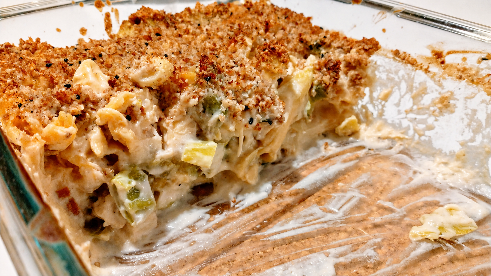

# Mama's macaroni

_Zonder hesp, kaas of eieren, en toch brengt deze schotel mij terug naar de macaroni uit mijn kindertijd._

## Bereidingstijd

* Voorbereiding: 30 minuten
* Kooktijd: 30 minuten
* Afwas: kookpot, spatel, vergiet, blender, snijplank, mesje en ovenschaal

## Ingrediënten (4 personen)

* 375 g macaroni of penne (volkoren of van rode linzen)
* 200-300 g gerookte tofu (aanrader: Taifun)
* 2 stengels prei en/of een andere groente (bijvoorbeeld witte kool, Chinese kool of paksoi)
* **voor de saus:**
    * 1 kleine bloemkool
    * 100 g cashewnoten
    * 4 el gistvlokken
    * 1 tl zachte mosterd
    * Een snuifje nootmuskaat
    * Peper en zout
    * Water
* **voor het korstje:**
    * Gemalen cashewnoten en/of amandelmeel
    * Zout

## Bereiding

1. Kook de bloemkool met de cashewnoten in een pot met deksel in een bodempje water, tot de bloemkool zacht is.
3. Breng bloemkool, cashews en kookwater over in de blender. Voeg de rest van de ingrediënten voor de saus toe en blend tot een gladde saus. Gebruik voldoende water: de saus mag in dit stadium nog niet te vast zijn. Proef en breng verder op smaak met peper en zout.
4. Kook de pasta gaar.
5. Was de prei, kool of andere groenten en snijd ze in dunne ringen. Stoof of stoom ze gaar met een kleine hoeveelheid vocht.
6. Snijd de gerookte tofu in kleine dobbelsteentjes.
7. Meng de groenten met de pasta, de gerookte tofu en de saus. Breng over in de ovenschaal.
8. Werk af met een mengeling van gemalen noten en zout.
9. Zet nog even in de oven op 200 &deg;C voor een korstje en/of om opnieuw op te warmen.
