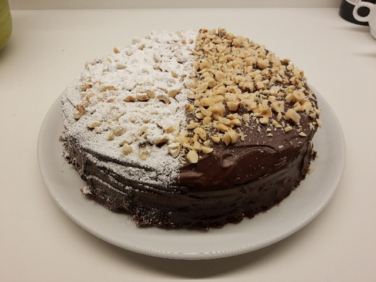
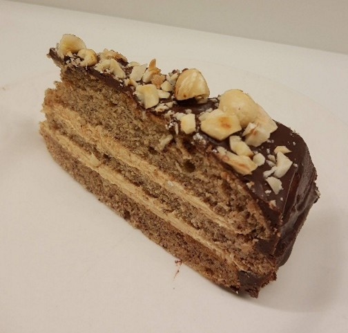

# Bananenbiscuit met Pindaboterroom

| | |
|---|---|
|  |  |

## Ingrediënten

### Beslag
  * 120 g kokosolie
  * 150 g sojamelk (echt wel soja, geen haver- of rijstmelk)
  * 16 g tapiocazetmeel (of maïzena)
  * 2 grote, rijpe bananen (225 g)
  * sap van een halve citroen (of 1 el appelazijn)
  * 100 g suiker
  * 225 g bloem
  * 1 tl natriumbicarbonaat (apart van het citroenzuur toevoegen)
  * enkele druppeltjes vanille-extract

### Pindaboterroom
  * 125 g bloemsuiker
  * 75 g plantaardige margarine (80% vet, vb. Alpro Bakken en Braden)
  * 75 g pindakaas
  * 20 g sojamelk

## Bereiding

### Beslag
  1. Smelt de kokosolie.
  2. Meng de kokosolie eerst met de suiker en daarna met de andere droge ingrediënten.
  3. Mix of blend de bananen met de sojamelk en het citroensap of de appelazijn.
  4. Voeg dit bij de rest van het deeg en meng goed.
  5. Bak 25-30 minuten op 180 &deg;C.

### Pindaboterroom
  1. Laat de margarine zacht worden, maar niet smelten.
  2. Meng de margarine onder de bloemsuiker en pindakaas.
  3. Klop wit en luchtig met de mixer of keukenrobot.
  4. Voeg een kleine hoeveelheid sojamelk toe tot je de gepaste smeuïgheid krijgt.

## Garneren

* Laat de taart afkoelen alvorens hem te ontvormen.
* Snijd hem in twee en smeer de pindaboterroom ertussen.
* Alternatief: smeer de pindaboterroom ertussen en erbovenop. Werk er ook de zijkanten mee af.
* Werk de bovenkant af met poedersuiker.

Zie foto bovenaan:

1. Recept x 2: drie lagen, uit twee cakes.
2. Alternatieve afwerking met een ganache van zwarte chocolade (met een beetje kokosroom) en daarbovenop gehakte, geroosterde hazelnoten.
