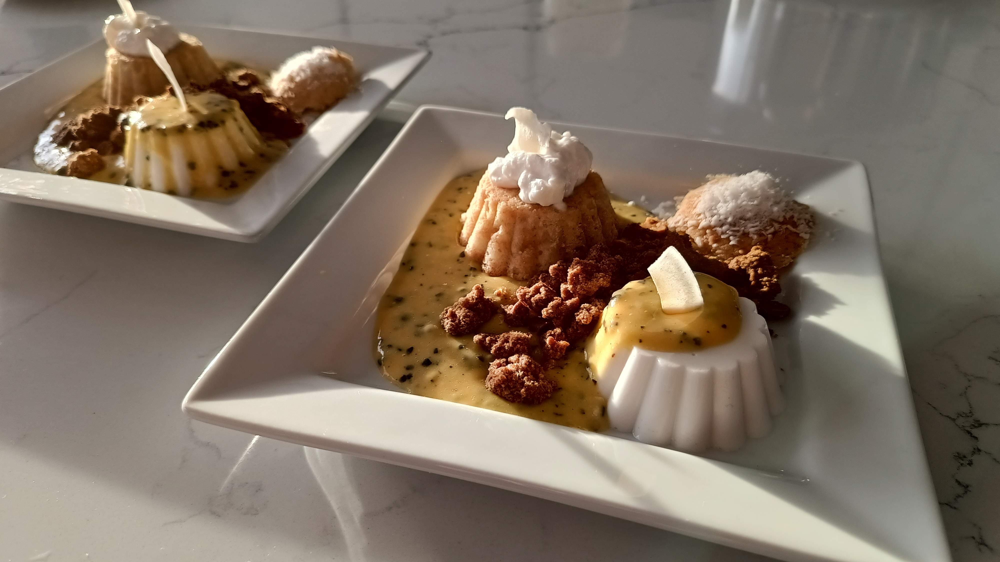

# Structuren van Kokos met een Crème van Passievrucht
*Als het eens echt feestelijk moet zijn!*

## Ingrediënten (15 bordjes)

* **Kokoscake**
  *	200 g bloem
  *	200 g suiker
  *	130 g kokospoeder 
  *	100 g kokosolie
  *	200 g sojamelk
  *	12 g tapiocazetmeel (of maïszetmeel)
  *	1 el appelazijn
  *	1 tl natriumbicarbonaat
  * snuifje zwart zout (eiersmaak, niet echt nodig)

* **Crumble**
  * 100 g roggemeel (tarwebloem kan ook)
  * 75 g (kinnekes)suiker
  * 100 g amandelpoeder
  * 50 g gehakte amandelen
  * 75 g margarine (> 70% vet, bv. Alpro Bakken en Braden)
  * snuifje zout

* **Panna cotta**
  * 800 ml kokosroom (2 blikken)
  * 100 ml water (om de blikken uit te spoelen)
  * 80 g suiker
  * 4 g agar agar
 

* **Crème van passievrucht**
  * 500 g passievrucht ([diepvriesblokjes](https://www.delhaize.be/nl/shop/Diepvries/Dessert/Fruit/Blokjes-Passievrucht/p/S2022032800447810096))
  * 100 g margarine (> 70% vet, bv. Alpro Bakken en Braden)
  * 75 g suiker
  * 1 tl xanthaangom

* **Garnituren**
  * yoghurt van kokosroom (bijvoorbeeld [Delhaize](https://www.delhaize.be/nl/shop/Bewuste-voeding/Zero-lactose/Yoghurt-en-Dessert/Yoghourt-Soja-Naturel-Ongezoet/p/F2019122700049020000))
  * kokospoeder
  * kokoschips

## Bereiding

* **Kokoscake**
  1. Smelt de kokosolie in de magnetron.
  2. Meng er de suiker en het kokospoeder onder.
  3. Voeg bloem, tapiocameel en bicarbonaat toe en meng tot een brokkelig deegje.
  4. Voeg de sojamelk en appelazijn toe en meng tot een glad beslag.
  5. Vul ongeveer 15 (siliconen) cupcakevormpjes tot 3/4 met het deeg.
  6. Bak 20-25 minuten op 180 &deg;C. Prik om gaarheid te testen.
  7. Laat afkoelen en ontvorm. Bewaar in een luchtdichte doos

* **Crumble**
  1. Meng suiker, bloem, kokospoeder, zout en gehakte amandelen.
  2. Kneed de margarine eronder met je handen. Blijf kneden tot je een egaal, korrelig deeg krijgt. Dit lukt het best als de margarine al op kamertemperatuur is.
  3. Verkruimel het deeg over een bakplaat.
  4. Bak de crumble goudbruin in ongeveer 20 minuten op 165 &deg;C. Schep halverwege om voor een egaal resultaat.
  5. Laat afkoelen en bewaar de crumble in een luchtdichte bokaal.

* **Panna cotta**
  1. Giet de kokosroom in een pannetje. Gebruik het water om de blikken uit te spoelen en gebruik dit ook.
  2. Voeg de suiker en de agar agar toe. 
  3. Breng aan de kook en laat enkele minuten doorkoken. Klop/roer intussen goed over de bodem met een garde.
  4. Vul ongeveer 15 (siliconen) cupcakevormpjes tot de rand en laat afkoelen.
  5. Bewaar in de frigo. 

* **Crème van passievrucht**
  1. Ontdooi de passievrucht in een (glazen) mengbeker
  2. Voeg de margarine en suiker toe. 
  3. Verwarm in de magnetron tot de margarine gesmolten is. 
  4. Voeg de xanthaangom toe 
  5. Mix goed door met de staafmixer tot een gladde, smeuïge saus 
  6. Bewaar in een pot met deksel in de frigo. 
  7. Verwarm en mix eventueel nog eens door voor gebruik, mochten er zich klontertjes gevormd hebben (kan gebeuren na lange tijd in de frigo).
  

## Presentatie

Zie foto bovenaan:
  1. Leg een panna cotta aan één kant van het bord.
  2. Giet er 1 eetlepel passievruchtcrème over en 2 eetlepels erlangs.
  3. Snijd het poepje van een cakeje en leg het cakeje omgekeerd in de passievruchtcrème.
  4. Leg een toefje kokokyoghurt op het cakeje
  5. Leg het poepje apart op het bord en bestrooi met kokokpoeder
  6. Schep enkele eetlepels crumble tussen de twee torentjes
  7. Werk de torentje af met twee stukjes kokoschips.

Of verzin iets helemaal anders!